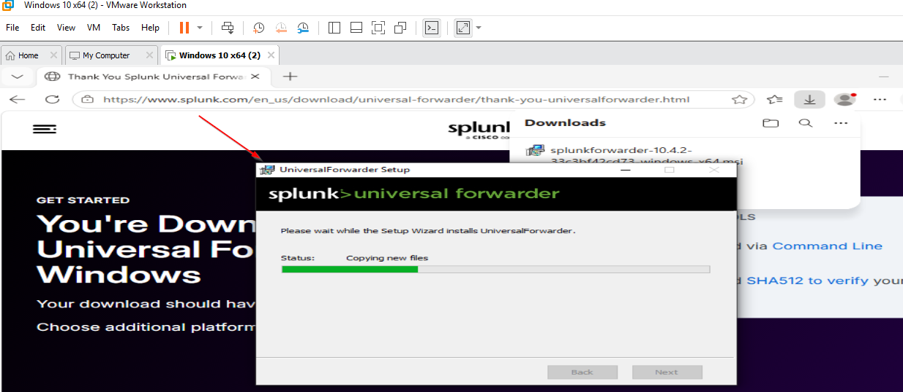
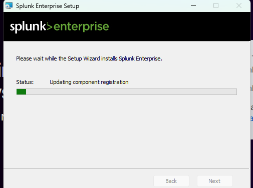
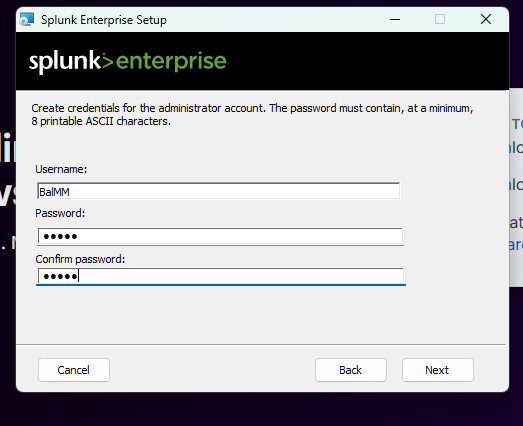

# Splunk Enterprise Installation (Host Machine)

[← Back to project overview](README.md)

With the endpoint in place, the next step was standing up the SIEM that would receive and analyze its logs. Splunk Enterprise was downloaded and installed directly on the host machine rather than inside a VM, so that it could act as a stable, always-available collection point regardless of what was happening inside the lab's virtual machines. During installation, administrator credentials were created for the instance, and after setup completed, a login to the Splunk web interface was used to confirm the installation had succeeded and the platform was ready to receive data.

*Downloading Splunk Enterprise on the host machine*

*Splunk Enterprise setup wizard*

*Splunk Enterprise installation in progress*

*Creating administrator credentials during setup*

*Splunk Enterprise sign-in page*

*Splunk Enterprise home page, confirming the installation completed successfully*

---

Next: [Splunk Universal Forwarder Installation & Configuration →](Splunk%20Universal%20Forwarder%20Installation%20and%20Configuration.md)
