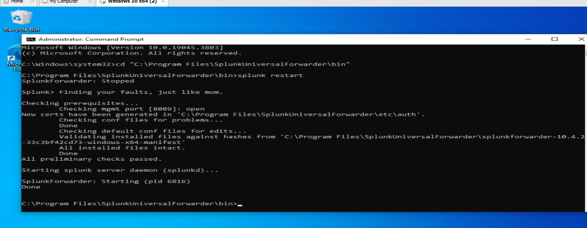
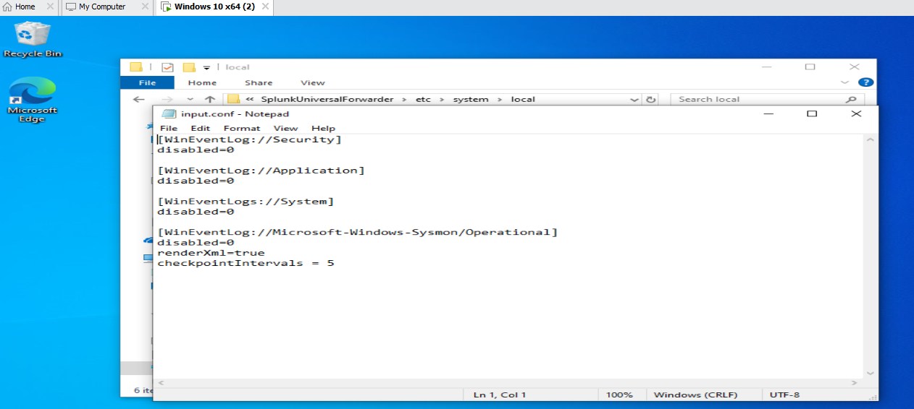

# Sysmon Installation & Configuration

[← Back to project overview](README.md)

## Installing Sysmon

With the transport layer between the VM and Splunk confirmed working, attention turned to the actual source of meaningful security telemetry: Sysmon. Sysmon (version 15.2) was installed on the Windows VM. Rather than running it with default settings, the SwiftOnSecurity configuration file was applied — a widely used, community-maintained Sysmon configuration that is tuned to capture high-value security events (process creation, file creation, network connections, and more) while filtering out noisy, low-value events. This is the same approach used in many real SOC environments, since raw default Sysmon output can be overwhelming and includes a large amount of noise.

*Downloading Sysmon from Microsoft Sysinternals*

*SwiftOnSecurity Sysmon configuration file retrieved from GitHub*

## Adding Sysmon as a Log Source

Installing Sysmon makes it generate events locally in Windows Event Viewer, but by default the Splunk Universal Forwarder does not know to collect that specific event log — it has to be told explicitly. The Forwarder's `inputs.conf` file was edited to add a new input stanza pointing at the Sysmon Operational event log, alongside the existing stanzas for Security, Application, and System logs. After saving the change, the Forwarder was restarted so the new configuration would take effect.

*inputs.conf updated with the Sysmon Operational log input*

*Universal Forwarder restarted to apply the new Sysmon input*

## Verifying Sysmon Locally

Before worrying about whether Sysmon data was reaching Splunk, it was important to confirm Sysmon was actually generating events at all. A test file was created on the Windows VM specifically to trigger a FileCreate event, and Windows Event Viewer was checked to confirm Sysmon Event ID 11 (FileCreate) appeared as expected. A general search was also run in Splunk Enterprise for events associated with the VM's hostname, to get an early read on what data was already flowing in.

*Sysmon Event ID 11 (FileCreate) confirmed in Windows Event Viewer*

*Splunk Enterprise search showing events from the Windows VM host*

---

Next: [Troubleshooting: Sysmon Forwarding Issue →](Troubleshooting%20-%20Sysmon%20Forwarding%20Issue.md)
