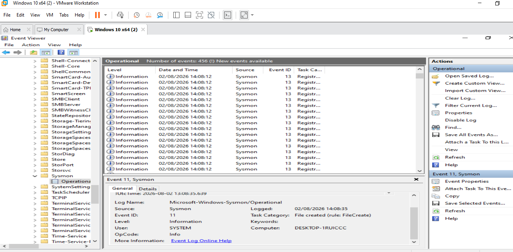
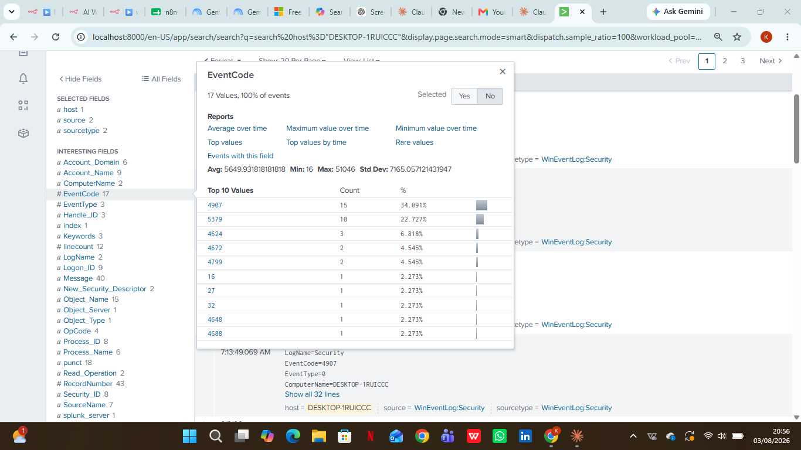
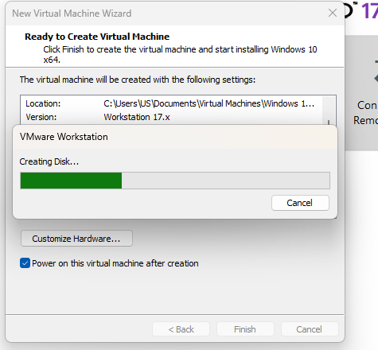

# Windows VM Setup

[← Back to project overview](README.md)

The first step was standing up the endpoint that would be monitored throughout the rest of the lab. A Windows 10 ISO was downloaded and used to create a new virtual machine in VMware Workstation. This VM was kept intentionally close to a default install — no additional hardening or software beyond what the lab required — since the goal at this stage was simply to have a realistic Windows endpoint to generate and monitor activity on.

*Downloading the Windows 10 installation image*

*Creating the Windows 10 virtual machine disk in VMware Workstation*

*Windows 10 VM running successfully, confirming the endpoint was ready for the next steps*

---

Next: [Splunk Enterprise Installation →](Splunk%20Enterprise%20Installation.md)
